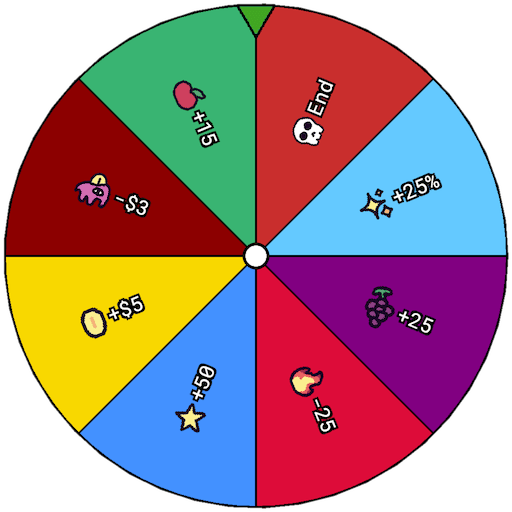

<p align="center">
  
</p>

# Spin to Win

[](https://github.com/remarkablegames/spin-to-win/releases)
[](https://github.com/remarkablegames/spin-to-win/actions/workflows/build.yml)

🎡 **Spin to Win** is a luck-based strategy game where every spin counts. Earn points, unlock upgrades, add segments, and remove penalties as you build your ultimate wheel. Can you reach the target score before luck runs out?

Play the game on:

- [itch.io](https://remarkablegames.itch.io/spin-to-win)
- [remarkablegames](https://remarkablegames.org/spin-to-win/)

## Credits

### Art

- [Kaplay Crew](https://kaplayjs.com/crew/)

### Fonts

- [Roboto Mono](https://fonts.google.com/specimen/Roboto+Mono)

### Music

- [Free Music Second Dealing by みんなの創作支援サイトＴスタ/T-STUDIO](https://t-studio-tst.itch.io/free-music-second-dealing)

### Sounds

- [Cash Register (Kaching) - Sound Effect](https://pixabay.com/sound-effects/film-special-effects-cash-register-kaching-sound-effect-125042/)
- [Kenney Interface Sounds](https://kenney.nl/assets/interface-sounds)

## Prerequisites

[nvm](https://github.com/nvm-sh/nvm#installing-and-updating):

```sh
brew install nvm
```

## Install

Clone the repository:

```sh
git clone https://github.com/remarkablegames/spin-to-win.git
cd spin-to-win
```

Install the dependencies:

```sh
npm install
```

## Environment Variables

Update the environment variables:

```sh
cp .env .env.local
```

Update the **Secrets** in the repository **Settings**.

## Available Scripts

In the project directory, you can run:

### `npm start`

Runs the game in the development mode.

Open [http://localhost:5173](http://localhost:5173) to view it in the browser.

The page will reload if you make edits.

You will also see any errors in the console.

### `npm run build`

Builds the game for production to the `dist` folder.

It correctly bundles in production mode and optimizes the build for the best performance.

The build is minified and the filenames include the hashes.

Your game is ready to be deployed!

### `npm run bundle`

Builds the game and compresses the contents into a ZIP archive in the `dist` folder.

Your game can be uploaded to your server, [itch.io](https://itch.io/), [newgrounds](https://www.newgrounds.com/), etc.

## Testing

### Scene

You can jump to a scene by adding `?scene=<name>` to the URL.

| Scene   | URL params (all optional)                                                      |
| ------- | ------------------------------------------------------------------------------ |
| `title` | _(none)_                                                                       |
| `cover` | _(none)_                                                                       |
| `game`  | `level`, `round`, `score`, `money`, `baseSpins`, `extraSpins`, `passiveIncome` |
| `shop`  | `level`, `round`, `score`, `money`, `passiveIncome`, `baseSpins`               |
| `end`   | `level`, `score`, `money`, `baseSpins`, `extraSpins`, `passiveIncome`          |

Examples:

```
http://localhost:5173/?scene=end&score=100
```

```
http://localhost:5173/?scene=game&level=1&money=50
```

```
http://localhost:5173/?scene=shop&level=0&round=1&score=100&money=50&passiveIncome=5
```

### Cover

The cover scene renders the wheel on a 1024×1024 canvas for use as a logo or cover image.

```
http://localhost:5173/?scene=cover
```
